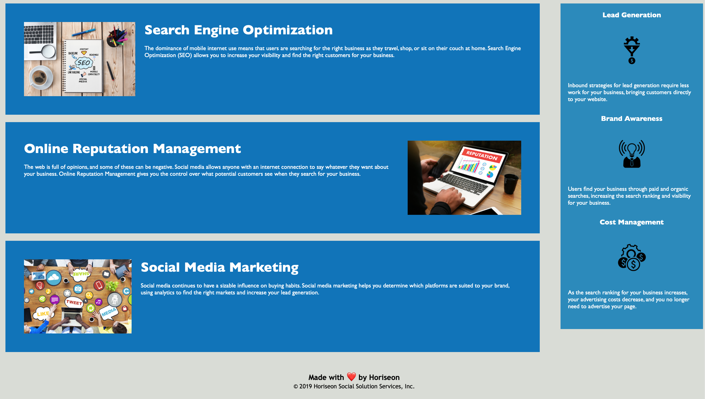

# HTML CSS Git Challenge: Code Refactor

##Project Description 
In this challenge, I completed a marketing agency's request to refactor its existing site to make it more accessible. 

In addition, I updated the codebase for long-term sustainability by adding comments to the files and consolidating CSS selectors and properties.

 

##URL of Deployed Application 

